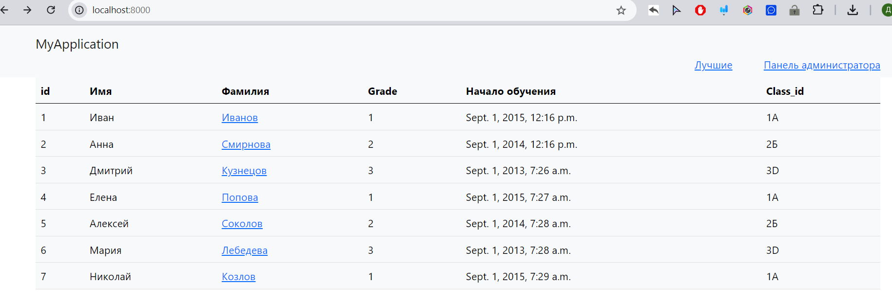
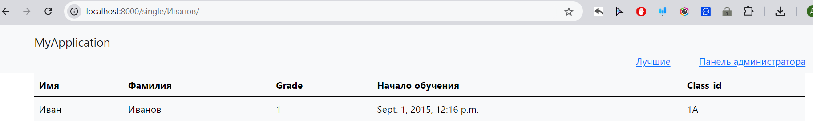
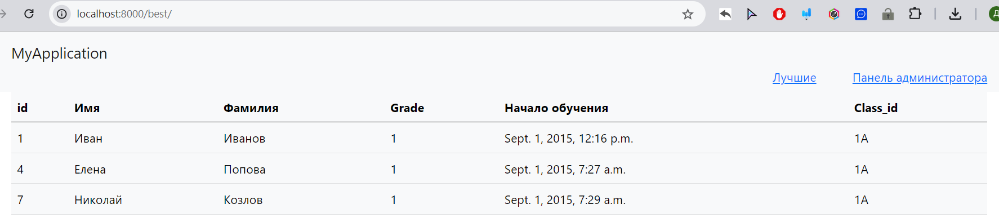
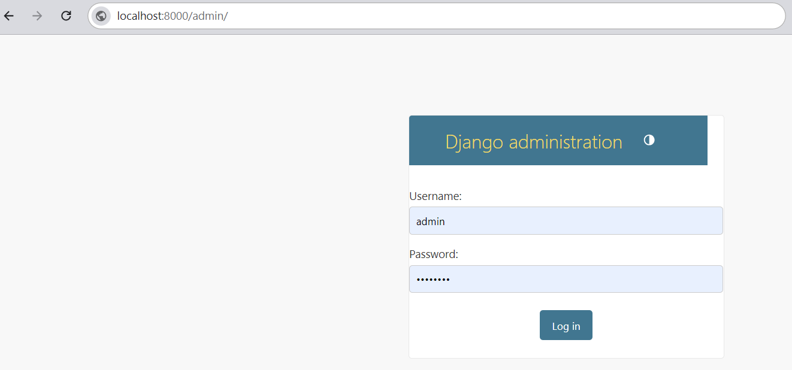

# Задание на экзамен по курсу Python

Задание выполняется по условиям ниже с учетом вашего варианта.
Варианты c индивидуальными заданиями представлены в таблице exel.
Выполненное задание размещается внутри данного репозитория.

## Задание

С помощью фреймворка Django создать сайт-приложение для отображения данных из базы данных(БД).
Установка пакетов производится в виртуальном окружении.
Сайт состоит из нескольких страниц. На Главной странице сайта выводятся все данные, загруженные в БД(см. рис 1).

### Рис 1

Данные в таблицы БД загрузить вручную с помощью созданной в фреймворке в Панели администратора (см рис4)
Также на Главной странице располагаются ссылки для перехода на другие страницы (выделены синим цветом) :

- одну ссылку на Панель администратора (см рис 4). Самим назначить Логин: admin , Пароль: admin
- одну ссылку на дополнительную страницу согласно вашего варианта (например лучших студентов) (см рис 3),
- ссылки на каждый элемент Главной страницы, оформить в виде ссылок внутри таблицы данных (например ссылка на одного студента см рис. 1 и 2)

и кликабельное название сайта , ведущее на Главную страницу приложения.

### Рис 2

### Рис 3

### Рис 4

Образцы БД по вариантам заданий в формате *.sqlite3 . Эти файлы представлены для описания структуры и содержания таблиц вашего приложения.
ВАЖНО: Название приложения назвать по имени базы данных.

Базовый уровень выполнения работы: Создать виртуальное окружение. Установить фреймворк, связать с БД.  Запустить сервер. Создать главную страницу по заданию, страницу одного предмета, страницу администратора (встроенная в Django) и переходы на эти страницы с других страниц.

Создать дополнительную страницу и переход на нее - плюс один балл.
А Создать дополнительное оформление - еще плюс один балл.

## Ход выполнения задания (примерный)

1. Организовать начальные настройки, установку пакетов в виртуальном окружении по необходимости и создать проект base.
2. Создать приложение, например,  "MyApplication" + прописать его маршруты + создать superuser(login, password) +все urls.py
3. Создание моделей по образцу БД, которую дали в варианте задания
4. Создание и применение миграций. Подключение приложения в settings.py
5. Добавим записи в таблицы через Панель администратора.
6. Создаем простые обработчики  запросов для маршрутов приложения.
7. Первая пара закончилась.
8. В папке приложения (MyApplication) создаем шаблоны (templates) в html формате
9. Связываем шаблоны с обработчиками.  Используйте QuerySetAPI для выборки нужных значений.
10. Вторая пара закончилась
11. Настроить отображение страниц при переходе по ссылкам, исправить ошибки.
12. Сдача и Защита работы.
